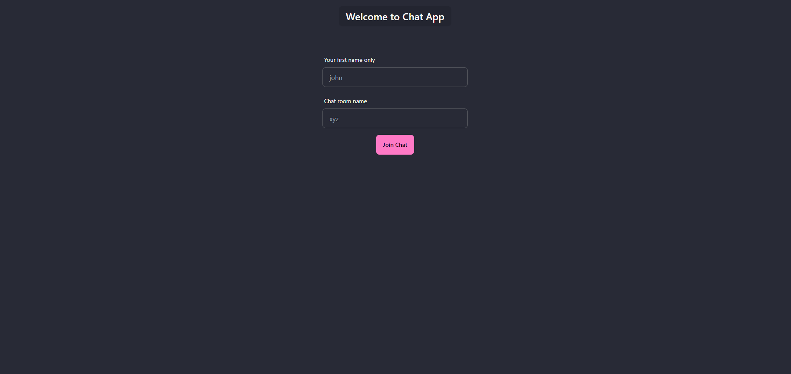
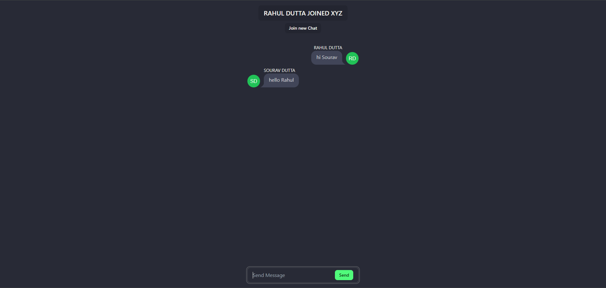
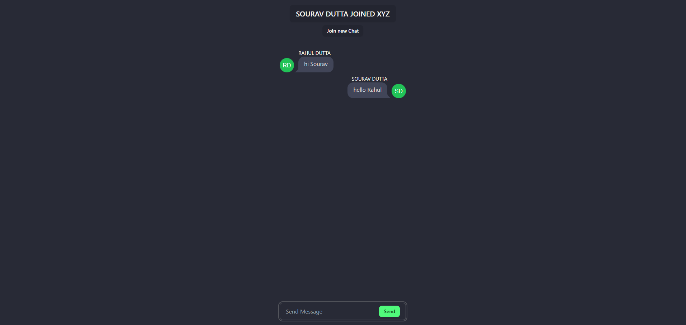

# chat-app

## Deployment

### [Frontend Deployed at Vercel 🔗](https://chat-app-rho-topaz.vercel.app/)

### [Backend Deployed at Render 🔗](https://chat-app-cnpi.onrender.com)

### FYI ⭐

The app is deployed on Render on free tier. It may take up to 50 seconds or few more to up the server for the chats depending upon your internet speed initially. It is not a performance issue.

## Preview

## Description

### Leveraging the power of Socket.Io made this app to real time chat two or more users in a chat room.

### FYI

- This app is not connected to any database.

## Tech Stack

- React
- DaisyUI
- Node.js
- Express
- Socket.io
